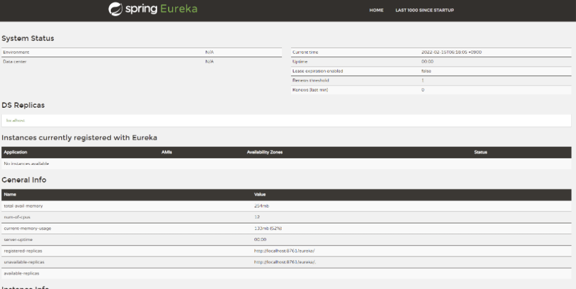
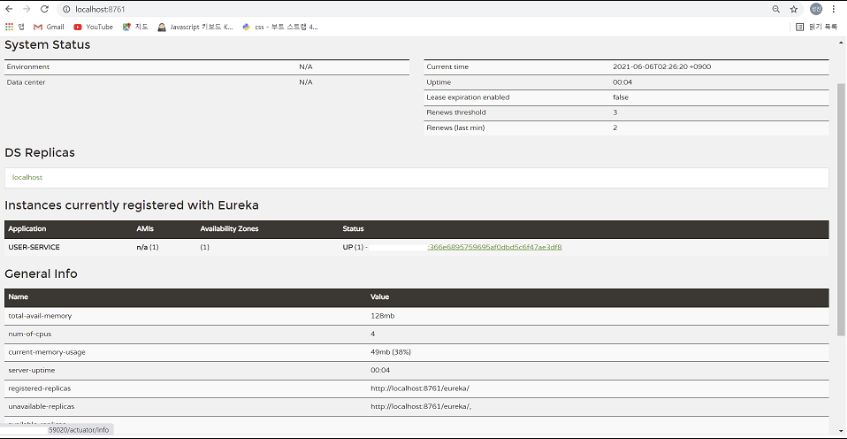
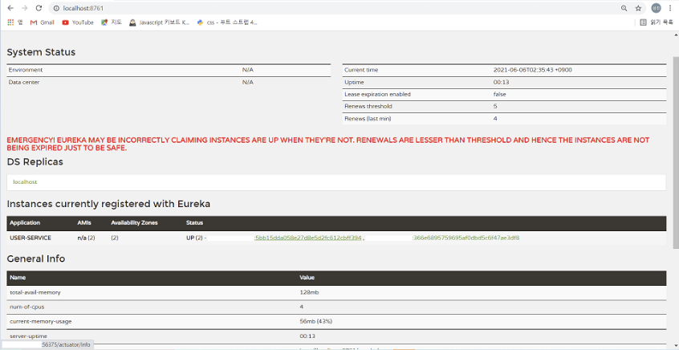

# Spring Cloud 개념 1

## Software 발전 과정
- __1960 ~ 1980__ : 메인프레임의 시대. 하드웨어로 모든 서비스들이 만들어짐
- __1990 ~ 2000__ : 분산 시스템의 발전. Robust, Distributed의 시기
- __2010 ~__ : Fragile과 반대되는 Anti-fragile, Resilient 시대. __Cloud Native를 활용한 시스템이 활발하게 구축__

<br>

## 2010년 이후 Software Architecture
- __Anti-fragile__
- __Auto Scaling__ : 자동 확장성, 사용량에 따라 자동으로 인스턴스 증가
- __Micro Service__ : 기존의 서비스들이 하나의 거대한 형태로 이루어진 것과 달리 전체 서비스를 구축하고 있는 개별적인 모듈 및 기능을 독립적으로 개발, 배포, 운영할 수 있는 세분화된 서비스
- __Chaos Engineering__ : 시스템이 급격하고 예측할 수 없는 상황에서도 견딜 수 있고 신뢰성을 쌓기 위한 기술 -> __예견되지 않는 상황 속에서도 안전해야 한다는 것을 의미!__
- __Continuous deployments__ : CI/CD와 같은 배포

- cf. __CI/CI란?__
Cloud Native Application은 수십개 ~ 수백개의 서비스로 구성. 이를 일일히 빌드, 테스트, 배포를 수작업으로 한다면, 시스템의 복잡성을 떠나서 애플리케이션을 구성하고 있는 각각의 서비스를 구상하고 빌드하는 것이 하나의 커다란 업무가 되어버릴 것이다. 이렇기 때문에 자동화된 시스템을 구축하고 하나의 작업에서 다른 작업으로 연계되는 과정을 파이프라인으로 연결 시켜놓으면 전체적인 시스템 업그레이드를 빠르게 적용 가능하다. __즉, Cloud Native와 Micro Service에 빠질 수 없는 기술!__

<br>

## Cloud Native Architecture
- 확장 가능한 Architecture (필요에 따라 변경 가능)
- 시스템의 수평적 확장에 유리 : 더 많은 사용자의 요청 처리 가능
- 확장된 서버로 시스템의 부하 분산, 사용성 보장
- 시스템 또는 Service Application 단위의 컨테이너 기반 가상화
- Cloud Native에 사용된 서버, 리소스 등 다양한 Tool로 Monitoring
- 탄력적 Architecture : CI/CD 기법 적용, 분할된 서비스 구조, 무상태 통신 프로토콜, 서비스의 추가와 삭제를 자동으로 감시하며 변경된 서비스 요청에 따라 사용자의 요청을 처리(동적 처리)
- Fault Isolation : 특정 서비스에 오류가 발생해도 다른 서비스에는 영향을 끼치지 않음, __왜냐하면 Micro Service는 하나의 작은 독립적인 Application이므로!__
- cf. 배포가 되는 Micro Service들은 자신의 위치가 어디에 있는지 등록을 해야한다. 그래야 다른 서비스들이 해당 서비스를 검색하고 사용할 수 있기 때문이다. Micro Service는 Discovery Service라는 곳에 등록하고 삭제 되도록 한다!

<br>

## Cloud Application
- Cloud Native Architecture에 의해 설계되고 구현된다.
- Micro Service로 개발
- CI/CD를 통해 `빌드 - 테스트 - 배포`를 자동적으로 해야한다 : 결과물을 통합하기 위한 형상관리 or 통합된 코드를 빌드하고 테스트하는 과정 자체를 의미한다.
- Devops : Micro Service에 문제가 생겼을 경우엔 바로바로 수정해서 배포, Development와 Operation이 합쳐진 말(개발조직과 운영조직의 통합을 의미). Devops환경은 지속적으로 기획, 빌드, 테스트, 배포 과정을 시스템이 종료될 때까지 무한으로 실시하여 바로 수정 가능. __Devops의 환경에 맞춰 서비스의 구조를 작은 단위로 분할할 수 있게끔하여 더 자주 통합 및 테스트, 배포할 수 있다!__
  - cf. 기존의 Application들은 고객의 요청에 맞게 도메인을 분석하고 시스템을 설계함. 애플리케이션 구현, 테스트, 배포 과정을 거쳐 시스템을 개발하기에 과정이 오래 걸렸었음 -> 기간이 길어지는 만큼 변화하는 요구사항 대처를 유연하게 하지 못하게 됨.
- 가상화는 Cloud Native Architecture의 핵심!
  - 왜냐하면 기존의 로컬 환경에서만의 개발이 아닌 Cloud 환경으로 이전해서 적은 비용으로 탄력성있는 시스템을 구축할 수 있기 때문이다. 또한, 컨테이너 가상화는 기존의 가상머신을 사용하는 것과 달리 공통적인 라이브러리나 리소스를 공유하여 각자 필요한 부분에서만 독립적인 영역에서 실행할 수 있는 구조이므로 더 적은 리소스를 이용하고 가볍고 빠르게 운영이 가능하다.

<br>
<br>

# Spring Cloud 개념 2

## 12 Factors

- Cloud Native Application을 만들때 고려해야할 12가지

1. __코드 통합__ : 형상관리를 위해 코드를 한 곳에서 배포하는 것이 주 목적
2. __종속성 배제__ : 각 Micro Service는 자체 종속성을 가지고 패키징 되어있다. 전체 시스템에 영향을 주지 않는 형태에서 변경 되어야 한다.
3. __환경설정의 외부 관리__ : 코드의 외부에서 관리도구를 통해 Micro Service에 필요한 작업들을 구성할 수 있어야한다.
4. __백업 서비스의 분리__ : 응용프로그램 자체에서 필요한 백업 서비스를 분리하게 됨으로써 서로 상호가능한 서비스 자체를 종속성 없는 상태에서 작업 가능해야한다.
5. __개발 환경과 테스트 운영 환경의 분리__ : 빌드, 릴리즈, 실행환경을 분리. 개발 서버에서 만들어진 코드를 배포하기 위해 실행단계까지 옮기는 환경을 엄격하게 관리해야한다.
6. __상태 관리__ : 프로세스 각각의 Micro Service들은 실행되는 서비스와 분리된 채, 프로세스에서 운영 가능해야한다.(독립성과 일치)
7. __포트 바인딩__ : 다른 Micro Service와 격리를 위해 각각의 Micro Service는 자체 포트에서 노출되는 인터페이스 및 자체에 포함되는 기능이 있어야한다.
8. __동시성__ : 하나의 서비스가 여러가지 인스턴스에 동일한 형태로 복사되면서 운영됨으로서 부하 분산이 가능해야한다.
9. __서비스의 올바른 상태 유지__ : 서비스의 인스턴스 자체가 삭제 가능하며 확장성을 높이고 정상적으로 종료될 수 있는 환경이 되어야 한다.
10. __개발과 production단계 구분__ : 환경자체를 최대한 다른쪽에 있는 작업과 중복되지 않고 종속되지 않는 상태로서 서비스를 유지할 수 있어야한다.
11. __Log의 분리__ : Log를 출력시키는 Logic은 기존에 있었던 Application Logic과 분리되어서, Application 자체가 실행되지 않는 상태라 해도 Logging만은 정상적으로 작동해야한다.
12. __관리 프로세스__ : 현재 운영되고 있는 모든 Micro Service들이 어떤 상태이며 어떤 리소스로 구성되어있는지 파악하기 위해 관리 도구가 필요하다. 이러한 작업에는 리포팅할 수 있는 기술이 포함되어 있어야하고 데이터정리 및 데이터를 분석하는 기능이 포함될 수 있다.

<br>

- 최근에는 12Factors에 3개의 항목을 더한 기준도 있음.
13. __API First__ : 모든 Micro Service는 API형태로 서비스 제공. API를 구축함에 있어서 사용자 측에서 어떤 형태로 사용할 것이지는 알아야한다.
14. __Telemetry__ : 모든 지표는 수치화 및 시각화 되어야한다.
15. __Autentication and Authorization__ : API를 사용함에 있어서 인증 과정은 필수이다.

<br>

## Monolithic VS MSA

1. __Monolithic__
  Application을 개발함에 있어 모든 요소들을 하나의 거대한 Software안에서 전부 포함시켜 개발하는 방법. 따라서 Application을 구성하는 서비스들 간의 의존성을 가진다. 이는 즉, 시스템을 일부만 수정하여도 전체 시스템을 다시 패키징하고 빌드 - 테스트 - 배포 해야하는 과정을 거쳐야 한다.

<br>

2. __MSA__
   Application을 구성하는 구성요소 및 Service를 분리하여 운영하는 방식.
   유지보수 및 변경사항의 적용이 쉬워진다. 변경이 필요할 때 필요한 부분만 변경하게 되고 다른 Service에 영향을 끼치지 않고 독립적으로 Service가 가능하다. __따라서 Application 자체가 down되는 현상을 없앨 수 있다!__
   심지어 각각의 Service들은 최소화된 중앙집중된 관리만 필요하고 서로 다른 언어 및 서로 다른 DB를 사용가능 하기까지도 하다!
   각각의 Service들은 제공해야하는 Service를 restAPI를 통해 제공 가능하며 다른 Micro Service들과 통신 가능하다.

<br>

3. __Trend__
   최근에는 Application 개발 시 Smart Device를 고려해야한다. 이제는 Web Browser 뿐 아니라 스마트워치, 스마트폰, 테블릿, 노트북과 같은 Device들도 고려해야한다. -> __사용자가 요청하는 형태로 응답이 가능해야 한다는 뜻!__
   이를 위해, __RestAPI를 사용!__

<br>

## Micro Service Architecture

* 특징
  * 1. __Challenges__ : 개발 방식 및 패러다임을 상당히 바꾸어야 함
  * 2. __small Well chosen Deployable Units__ : 독립적으로 개발 가능한 형태의 작은 서비스
  * 3. __Bounded Context__ : 각각의 서비스들은 애플리케이션을 구성하고 있는 전체 도메인의 지식에 따라 서비스 경계를 잘 구분해야 경계로 인해 하나의 서비스가 여러개, 여러개가 단일화 될 수 있다.
  * 4. __Restful__ : 상태에 대해서 restAPI로 통신 JSON포맷 이용 서버의 리소스 및 상태 표시에 최적화
  * 5. __Configuration management__ : 마이크로 서비스들이 갖고 있는 설정 및 환경 정보는 코드 내에 갖고 있지 않고 외부에 시스템을 통해 관리
  * 6. __cloud enabled__ : 클라우드 네이티브 기술을 최대한 활용
  * 7. __dynamic scale up and down__
  * 8. __CI/CD__
  * 9. __visibility__ : 마이크로서비스 기술들은 시각화 할 수 있는 관리도구들을 가지고 있어야한다.

<br>

__이렇게 Micro Service Architecture가 엄청난 기술이다! 라는 것을 확인해보았다!__

<br>

__BUT!  무조건 Micro Service Application만 만들어야 할까?__
* 처한 환경 및 기존 Application에서 MSA로 전환 혹은 Application 개발시 생기는 이익에 대해 생각을 해봐야한다.

<br>

1. 변화로 인해 생기는 이익이 어느 정도 이상이 되어야 Micro Service Application으로 전환을 할 것인지 봐야한다.
2. 유지 보수 및 확장성에 대처가 가능한지 확인한다.
3. 오류를 격리시킬 수 있는지 확인한다.
4. 외부 종속성과 상호 작용을 단순화 시킬 수 있는지 확인한다.
5. 여러가지 프로그래밍 언어,스토리지 기술을 지원 할 수 있는지 확인한다.

__위의 환경들이 충분히 고려되어 있다고 하면 전환 및 도입이 가능할 수 있다!!__

<br>
<br>

# Spring Cloud 개념 3

## SOA VS MSA
1. __SOA__
   - 공통의 서비스를 ESB(BUS)에 모아 사업 측면에서 공통 서비스 형식으로 서비스 제공
   - 재사용을 통한 비용 절감
   - 서비스 및 DB에 직접 접근
   - 서비스 공유 최대화

<br>

2. __MSA__
   - 서비스 간의 결합도를 낮추어 변화에 능동적으로 대응
   - 서비스 및 DB접근 시, API를 통해 접근
   - 서비스 공유 최소화

<br>

## REST API
* 기본적으로 HTTP Method를 사용하며 방식에 따라 Level이 나뉨

<br>

* __Level 0__
  * REST 방식으로 Application이 고려되기 보다는 기존의 Resource를 단순하게 Web Service 상태로서 제공하기 위해 URL만 맵핑
  * ex) http://server/getPosts

* __Level 1__
  * Web으로 공개하고자하는 Resource를 위해 적절한 URI로 표현
  * 적절한 패턴을 가지고 작성되었지만 HTTP의 Method별로 서비스를 구분해서 사용하지 않는다.
  * 사용자 요청을 단순히 Get과 Post로 처리하고 모든 반환값에 대해 에러코드 및 성공코드(200)을 반환
  * ex) http://server/accounts/10

* __Level 2__
  * Level 1단계에서 HTTP Method를 추가
  * 제공하려는 Resource를 용도와 상태에 맞게 HTTP Method를 이용할 수 있는 단계
  * ex) Read : Get Method / Create : Post Method / Update : Put Method / Delete : Delete Method

* __Level 3__
  * Level2 + HATEOS
  * 데이터를 가지고 그 다음 작업에서 어떠한 Action이 가능한지 상태 정보를 같이 넘겨주는 형태 -> __이러한 모든 정보가 같이 알려질 수 있는 기능을 HATEOS!__
  * Client 측에서는 서버가 제공하는 Service를 일일히 찾지않고 End Point만 가지고 있으면 서버가 제공할 수 있는 그 다음 URI값을 알 수 있음
  * __Additional!__
    * 소비자 입장에서 간단하고 명료하게 설계를 해야함
    * HTTP의 장점을 최대한 살려서 개발하는 것이 필요
    * 최소한 Level 2의 특징을 살려야 함
    * 각각의 요청에 따른 적절한 상태코드가 전달되어야 함
    * 성공 및 실패 이유를 상태에 따라 적절히 Reponse 해야함
    * 사용자와 비밀번호 같은 Critical 정보를 담으면 안됨
    * 제공하는 데이터에 대해 단수 형태가 아닌 복수 형태의 URI 값을 쓰는 것이 일반적
    * 모든 Resource는 가능하면 명사 형태

<br>

206 + 150 = 356..

## MSA 동작 방식

* 독립적으로 CI/CD
* Micro Service들은 Container virtualization을 통해 구현됨.

1. Client & Another Micro Service들은 API Gateway라는 진입점을 통해 진입.
2. Service 요청을 위해 Service Router에게 어디로 가야할지 질문
3. Service Discover를 통해 Micro Service들이 어디 있는지 찾음
4. Service가 어디에 있는지 검색 완료되면 Load Balancing을 통해 어떠한 Service로 갈 것인지 결정
5. Service의 Response를 API Gateway를 통하여 반환
   - Service Mesh
   - MSA를 적용한 System의 내부 통신
   - URL 경로, Service Header, etc Application의 규칙 정의
   - Proxy를 통해 Router 및 Circuit Breaker의 역할 가능
   - Configuration, Routing, Authentication, Resilience, Cryptography 지원

<br>

## Spring Cloud

- 독립적인 Service, MSA를 제공하기 위한 Cloud
- 환경 설정 관리, Service 관리, 회복성, Routing, Service Discovery, Proxy를 사용하는데 있어서 필요한 분산 System에 빠르게 Application을 개발하는데 목적을 두고 만들어짐!
- 공식적으로 지원하는 Service는 다양하며 Spring Boot와 Spring Cloud를 둘 다 사용해야한다.

<br>
<br>
<br>

# Service Discovery

<br>
## Spring Cloud Netflix Eureka
- 넷플릭스에서 MSA를 위해 Spring Cloud에 기부한 오픈소스
- 하나의 서비스는 여러개의 인스턴스로 부하 분산 가능
- 모든 Micro Service는 Spring Cloud Netflix Eureka에 등록
- Eureka는 ServiceDiscovery 역할을 함 즉, 외부의 Service 및 client에게 서버나 서비스의 위치가 어디에 있는지 알려주는 역할을 함
- Service 등록 및 검색에 관련된 작업
- 즉, MSA에서 회원, 주문, 상품 등등 각각의 서비스들에 대한 정보를 저장하여 외부에서 서비스 호출 시 그에 맞는 서비스 서버로 전달해주는 미들웨어이다.


<br>

## Service Discovery
- Client가 서비스를 호출할 때 서비스의 위치(즉, IP와 PORT 정보)를 알아야 호출할 수 있는데 이러한 정보들을 저장, 관리하는 것을 Service Discovery라고 한다.
- 구현 방법은 크게, Client-side Discovery 방식과 Server-side Discovery 방식이 있다.

#### Client-side Discovery


- Client 서비스가 Service Registry에서 서비스의 위치를 찾아서 호출하는 방식으로 대표적으로는 __Netflix Eureka__ 가 있다.
- Service 인스턴스의 위치는 인스턴스가 생성될 때 registry에 등록되고, 인스턴스가 종료될 때 registry에서 삭제된다.
- 장점
  - 상대적으로 간단하다.
  - 클라이언트가 사용가능한 서비스를 알고 있어 서비스별로 개별적인 로드밸런싱 방법을 선택할 수 있다.
- 단점
  - Client와 Service registry간의 의존성이 발생한다.
  - Client에서 service를 찾는 로직, 즉 Discovery 로직을 구현해야한다.

<br>

#### Server-side Discovery


- Client가 별도의 로드밸런스를 통해 서비스 요청을 보내면 로드밸런서가 service Registry에 서비스 네트워크 주소를 질의한 후 사용가능한 서비스로 요청을 라우팅한다. 대표적으로는 __AWS Elastic Load Balancer(ELB)__ 가 있다.
- Client-side Discovery와 동일하게 각 서비스는 Service Registry에 등록되고 해제된다.
- 장점
  - Discovery 관련된 세부 내용을 클라이언트로 분리할 수 있다.
  - Client는 Discovery 로직을 구현할 필요가 없다.
- 단점
  - 로드밸런서는 배포환경에 구축되어야한다.
  - Service Discovery가 죽게되면 전체 시스템이 동작하지 않기 때문에 높은 가용성이 요구되며 관리가 필요하다.

<br>

## 직접 구현해보자!

#### Application.yml - 환경 설정 정보

__Eureka Server__

```java
@SpringBootApplication
@EnableEurekaServer
public class EcommerceApplication {
  public static void main(String[] args) {
    SpringApplication.run(EcommerceApplication.class, args);
  }
}
// 생성된 프로젝트의 @EnableEurekaServer 어노테이션을 추가하여 Spring이 시작될때
// 현재 프로젝트가 유레카 서버임을 등록한다.
```

```yml
server:
  port: 8761

spring:
  application:
    name: discoveryservice

eureka:
  client:
    register-with-eureka: false
    fetch-registry: false
```

* 포트번호는 8761
* Service 이름은 discoveryService
* register-with-eureka(유레카 서비스로 등록) : Eureka 클라이언트 역할을 수행하기 위한 설정값으로, 현재는 서버 역할만 수행하기 때문에 false
* fetch-registry(해당 서비스가 검색되도록 등록) : service registry에 있는 정보를 가져올지에 대한 설정으로 false설정 시 Eureka Server를 호출하지 않게 된다.

__결과__


__Eureka Client__

```java
@SpringBootApplication
@EnableDiscoveryClient
public class UserServiceApplication {
  public static void main(String[] args) {
    SpringApplication.run(UserServiceApplication.class, args);
  }
}
// @EnableDiscoveryClient 어노테이션을 추가하여 Client라고 선언한다. 
```

```yml
server:
  port: 0

spring:
  application:
    name: user-service

eureka:
  instance:
    instance-id: ${spring.cloud.client.hostname}:${spring.application.instance_id:${random.value}} #Eureka에 등록되는 서비스 이름에 대한 설정값
  client:
    register-with-eureka: true
    fetch-registry: true
    service-url:
      defaultZone: http://localhost:8761/eureka
```

* __포트 번호를 0으로 놓는 이유?__
   * 하나의 Service를 여러개의 인스턴스로 등록하기 위해! -> 포트번호를 줌으로서, 인스턴스를 구분
   * - Service를 구동 시, 구동할 때마다 포트 번호를 직접 정해주는 것은 굉장히 번거로운 작업이다.
   * - 그렇기에, __구동할 때 마다 포트 번호를 랜덤으로 주기 위해 0으로 설정하자!__ 
   * 만약 yml의 instance-id를 설정하지 않으면 `ip:서비스 이름:포트`의 노출값이 동일하여 유레카에서 하나로 인상하는 현상이 나타난다.. 
* Service 이름은 user-service
* __instance_id를 주는 이유는?__
  * 포트 번호를 랜덤으로 주기 위해 0으로만 설정해 놓으면 유레카 서버에서 포트 번호가 0으로만 나와 인스턴스를 구분하지 못한다. 따라서, 별도로 인스턴스를 명시해주는 포트 값을 random.value로 추가 설정해줘야한다.
* register-with-eureka(유레카 서비스로 등록) : Eureka 클라이언트 역할을 수행하기 위한 설정값으로 서버 역할만 수행하기 때문에 false
* fetch-registry(해당 서비스가 검색되도록 등록) : service registry에 있는 정보를 가져올지에 대한 설정으로 false설정 시 Eureka Server를 호출하지 않게 된다.
* service-url : 어느 Eureka Server에 등록을 할 것인지 Eureka Server의 url을 적어준다.

<br>

## Service를 여러 개의 인스턴스로 실행하는 방법

#### 인텔리제이 내의 터미널에서 실행하기

* 프로젝트의 최상단으로 이동하기(src, target, pom.xml이 있는 위치)
* Maven 컴파일러 명령어 직접 사용
* mvn spring-boot:run


#### Cmd 및 Terminal 이용

* 프로젝트의 최상단으로 이동하기(src, target, pom.xml이 있는 위치)
* (직접 빌드하여 target 밑에 jar 파일을 생성하여 실행하는 방법이다.)
* 명령어
* mvn clean : 기존에 Build 되어있었던 정보를 지운다(target 폴더 지워짐)
* mvn compile package : 빌드하는 과정, 빌드가 끝나면 target이라는 폴더가 생성되며 그 아래 jar파일이 만들어진다.
* java -jar ./target/userservice-0.0.1-SNAPSHOT.jar : 서비스 구동


<br>

## 실행 모습(localhost:Eureka_server_port로 접속하면 Eureka 서버 현황을 볼 수 있음)

* 등록된 Service가 없을때


<br>

* Service 하나만 등록



<br>

* 등록된 서비스가 2개 일때



<br>

__결론 : user-service에서 두 개의 인스턴스로 분산된 것을 보여주고 있다. 또한, 왼쪽 하단을 보면 설정한 대로 포트번호(59020, 56375) 또한 랜덤으로 잘 실행된 것을 볼 수 있다.__

<br>
<br>
<br>

# API GATEWAY

<br>

## API Gateway Service

* 일종의 Proxy 역할
  * 사용자가 설정한 라우팅 설정에 따라 각각 end point로 클라이언트를 대신해서 요청하고, 응답을 받으면 다시 클라이언트에게 전달을 해주는 일종의 Proxy 역할을 한다.
  * Client가 Micro Service를 직접 호출하는 구조는 별로 좋지 않다.
* 시스템의 내부 구조는 숨기고 외부의 요청에 대해 적절히 가공을 해서 응답할 수 있다는 장점
* 즉, Client는 각각의 Micro Service들과 통신하는 것이 아닌 API Gateway랑 통신하게 된다.
* Micro Service 내에 Micro Service들이 변경을 했을 경우?
  * Service들 끼리는 독립적으로 빌드, 배포하기에 상관은 없다 But, Micro Service의 주소로 직접 요청을 하는 클라이언트 입장에서는 변경이 필요하다. 

```html
위의 이유들로 인해서 Micro Service Application 개발 시 단일 진입점을 가지고 있는 형태로서 개발되게 해야한다.
이를 위해, Gateway 역할을 해주는 진입로를 넣어주고 Gateway는 Micro Service에 요청되는 모든 정보들을 일괄적으로 처리해준다.
```

<br>

## API Gateway 주요 기능
* 인증 및 권한 부여
* Micro Service들의 검색 통합
* 응답 캐싱
* 정책, 회로 차단기(Client가 요청한 Micro Service에 문제가 생기면 그 회로를 차단)
* 속도 제한
* 부하 분산
  * ex) A라는 Micro Service가 3개의 인스턴스로 나뉘어졌을 경우에도 판단 가능
* Logging(로깅) 추적
  * 하나의 Service가 다른 Service를 호출하는 경우도 많은데 진입점 및 중간 단계를 거치고 그 다음 단계는 어디인지도 추적 가능 -> __Logging하는 작업 필요!__ API Gateway는 어떤 클라이언트가 어느 서비스에 요청했는지 로그 파일을 처리 가능
* IP 허용
  * 목록에 추가 허용할 수 있는 IP와 차단 IP 처리(일종의 방화벽처럼 사용 가능)

<br>

## Spring History About API Gateway

* restTemplate, Feign Client
  * Spring Cloud에서 MSA간 통신을 위해 restTemplate, Feign Client를 개발하여 사용했었다.
  * 문제 : Load Balancer를 하기 위해 어떤 Service에 구축해서 작업할 것인가..
* Ribbon
  * Spring Cloud는 Load Balancer를 해주는 별도의 서비스를 위해 Netflix가 가지고 있는 기술인 Ribbon이라는 서비스를 제공
  * Client측 내부에 Ribbon을 구축해서 사용
  * Client 안에서 이동하고자 하는 주소값을 직접 관리
  * ip:port를 명시하지 않아도 Service를 이름만으로 호출 가능
  * 문제 : 비동기화 처리가 잘 되지 않음..(현재는 maintenance 상태 - 더이상 새로운 기능이 추가 안됨 / Spring Boot 2.4이상 버전에서는 더이상 지원하지 않음)
* Netflix Zuul
  * Gateway의 역할을 해주는 서비스
  * Client가 직접 호출하지 않을 수 있었음
  * Ribbon가 마찬가지로 maintenance 상태이며 Spring Boot 2.4이상 버전에서는 더이상 지원하지 않음
* __Spring Cloud Gateway__
  * 비동기 처리 또한 가능해졌다.
  * 동기 방식인 Tomcat 서버가 아닌 비동기 방식인 Netty 서버로 실행된다.
  * 현재 널리 쓰이고 있다. 

cf. 비동기 방식이란?
* Reactive Programming
* blocking process로 동작하는 Application을 non-blocking process로 동작하기 위해 지원하는 Programming
* 기존 Spring : Blocking 방식
  * Web에서 서버에 요청이 왔을 때 서버는 요청에 대한 적절한 응답을 보내야하는데 만약 작업이 오래 걸릴 경우에는 요청에 대한 응답이 모두 종료될 때까지 Blocking 됐었다.
  * 이러한 이유로 Spring에서는 동시 요청 처리를 위해 멀티 Thread를 지원하였고, Thread마다 다른 요청을 할당 받아서 처리를 한다.
  * 물론, 요청을 동시에 처리하니 비동기처럼 보일 수 있으나, Thread가 늘어날수록 Thread 할당에 필요한 Resource가 늘어나게 되므로 비효율적이다!
* Spring 5 : Non-Blocking
  * Spring 5가 도입되면서 클라이언트 요청에 별도의 Thread를 생성하지 않고 Buffer를 사용해서 요청을 받고 요청을 Back단에서 처리하는 Thread를 둔다.
* __그렇다면 왜 Non-Blocking 방식이 사용될까?__
  * 만약, 수천개의 Stream Data가 초 당 계속 Update되는 시스템이라면
  * 적절하게 응답을 해야하는 경우 기존의 Blocking 방식은 상당한 부하가 걸린다. __그래서, 부하를 효율적으로 처리하자는 목적으로!!__

<br>

## Spring Cloud Gateway

* Gateway Handler Mapping으로 들어오는 요청들을 적절한 대상으로 라우팅하는 간단하고 효과적인 방법 제공
* 기존의 내장서버는 Tomcat이었다. 하지만 Gateway의 내장서버는 Netty이다.
* Netty는 Non-Blocking, 비동기 방식이다. 때문에 서블릿 컨테이너나 war로 빌드하면 동작하지 않는다.


* Spring Cloud Gateway는 기본적으로 3가지의 핵심 단위로 구성되어있다.
  * __Route__ : 목적지 URI, 충족해야 될 여러 조건들(Predicates), 각종 필터들로 이루어진 요청을 라우팅할 대상들이라고 가정
  * __Predicate__ : 자바 8의 Function Predicate로 이루어져있다. path 혹은 request 헤더에 포함된 조건들을 의미한다. 즉, 라우팅에 필요한 조건!
  * __Filter__ : 스프링 프레임워크의 WebFilter의 인스턴스이다. 사용자가 보내는 request, 응답받는 response를 수정하거나 정제하는 것.

<br>

## Spring Cloud Gateway의 동작 방식


* Client는 Spring Cloud Gateway에 요청을 보낸다.
* Gateway Handler Mapping이 요청 정보가 Gateway에 설정된 Route로 전달하는 것을 결정하고, Gateway Web Handler에게 전송한다.
* Gateway Web Handler는 요청에 따른 FilterChain을 통해 요청을 보낸다.
* 그림에서 Filter들이 점선으로 구분된 이유는, Proxied Service에 요청을 보내기 전에 해당 Gateway 서버에서 Filter를 통한 로직을 수행해야하기 때문이다. 위에서 말했던 __API Gateway 주요 기능. 이라 생각하면 되겠다.__
* 사전에 Filter들에 대한 로직을 수행한 다음, Proxied Service에 원하는 정보를 얻고, 사후 Filter들에 대한 로직이 동작하여 Client에게 응답이 간다.

#### Gateway 관련 프로젝트 생성
* Lombok
* Gateway
* Eureka Discovery Client 3개의 의존성 추가

__apigateway-service__

```yml
server:
  port: 8000

eureka: #eureka 세팅은 현재 사용 안함
  client:
    fetch-registry: false
    register-with-eureka: false
    service-url:
      defaultZone: http://127.0.0.1:8761/eureka

spring:
  application:  #gateway service 이름름    
    name: apigateway-service
  cloud:
    gateway:  #gateway 설정
      routes:
        - id: first-service #gateway로 연결될 서비스 이름
          uri: http://127.0.0.1:8001/ #gateway로 연결될 서비스 uri
          predicates: #gateway로 연결될 서비스의 url 매핑
            - Path=/first-service/**
        - id: second-service
          uri: http://127.0.0.1:8002/
          predicates:
            - Path=/second-service/**
```

* yml 설정 후 서버를 실행해보면..
  * 정상적으로 실행되며 WAS가 Tomcat(동기)이 아닌 Netty(비동기)로 실행됨을 확인할 수 있다. WAS가 Netty로 실행됨을 확인할 수 있으며 Gateway 서버는 __비동기방식__ 으로 실행됨을 확인할 수 있다!

<br>

__first-service__
* Lombok
* Spring Web
* Eureka Discovery Client 3개 의존성 추가

```yml
server:
  port: 8001
spring:
  application:
    name: first-service
eureka:
  client:
    register-with-eureka: false
    fetch-registry: false
    service-url:
      defaultZone: http://127.0.0.1:8761/eureka
```
* eureka는 바로 보진 않을 것이지만 그래도 우선 설정해놓자.

<br>

```java
@RestController
public class HelloController {
    @GetMapping("hello")
    public String hello(){
        return "hello first service";
    }
}
```
* 간단한 controller 생성하여 first service 반환하게 해보자.


* seoncd-service도 똑같이 만들어서 실행해보자!(포트 번호만 다르게)


__이제 Gateway로 요청해보자!!__

<br>

* localhost:8000/first-service/hello 를 하게 되면 404에러가 뜬다..
* 그 이유는
* gateway에서 서비스를 구별하기 위해 pre 경로를 붙이는데 해당 경로가 해당 서버의 요청에 그대로 붙기 때문이다.
* 예를들어 `/first-service/hello` 라고 요청했을 때, first-service에 `/hello` 로 요청되는 것이 아닌 `/first-service/hello` 그대로 요청이 된다.

##### 방법은 간단하다.
```java
@RestController
@RequestMapping("/first-service")
public class HelloController {
    @GetMapping("hello")
    public String hello(){
        return "hello first service";
    }
}
```

```java
@RestController
@RequestMapping("/second-service")
public class HelloController {
    @GetMapping("hello")
    public String hello(){
        return "hello second service";
    }
}
```

* 각 서비스에 매핑되는 pre Path를 그대로 붙여주면 된다.

* 이제 Gateway로 불러보자!!


## Spring Cloud Filter란?
* Client가 Spring Cloud Gateway로 요청을 하게 되면 Gateway는 해당하는 서비스로 요청을 분기해준다. Gateway안에서 Gateway Handler Mapping으로 어떤 요청이 들어왔는지 요청 정보를 받고, 요청에 대한 사전 조건으로 인하여 설정 정보의 predicate 영역에서 분기 시켜주는 것이다!
* Gateway는 요청을 분기시켜주기 전과 서비스에게 요청에 대한 응답을 받은 후에 각각 Filter를 처리해줄 수 있다. 이를 pre filter와 post filter라고 한다.

#### 동작방식
1. Client Reques
2. Gateway Handler(진입점)
3. predicate 영역에서의 분기
4. pre-filter 처리
5. 서비스에서의 요청 처리
6. post-filter 처리
7. Gateway Handler
8. Client

## Filter 설정

* Custom Filter 개발
* Global Filter 개발
* Logging Filter 개발

<br>

## yml이 아닌 JAVA Code로 설정하기

* 기존에 작성한 yml 설정을 모두 주석처리한다.


<br>

* com.example.gateway.config라는 패키지를 만들고 FilterConfig라는 클래스를 만들자.
* 다음과 같이 설정하면 기존의 yml 설정과 동일한 설정에 filter를 주어 header에 해당 값들을 넣어줄 수 있다.

```java
@Configuration  //해당 어노테이션을 통해 spring이 시작될때 context에 자동으로 등록되도록 한다.
public class FilterConfig {
    @Bean
    public RouteLocator gatewayRoutes(RouteLocatorBuilder builder){
        return builder.routes()
                .route(r-> r.path("/first-service/**")
                        .filters(f-> f.addRequestHeader("first-request","first-request-header")
                                    .addResponseHeader("first-response","first-response-header"))
                        .uri("http://127.0.0.1:8001"))  //기존 yml에서 1번 서비스 설정과 동일
                .route(r-> r.path("/second-service/**")
                        .filters(f-> f.addRequestHeader("second-request","second-request-header")
                                    .addResponseHeader("second-response","second-response-header"))
                        .uri("http://127.0.0.1:8002"))  //기존 yml에서 2번 서비스 설정과 동일
                .build();
    }
}
```

<br>

* first-service / second-service 수정
```java
@GetMapping("/message")
public String message(@RequestHeader("first-request") String header){
    log.info("header = {}",header);
    return "header = "+header;
}
```

```java
@GetMapping("/message")
public String message(@RequestHeader("second-request") String header){
    log.info("header = {}",header);
    return "header = "+header;
}
```

<br>

* 기존 코드에 다음과 같이 header값을 출력해보기 위해 log와 반환 문자열에 추가해주면
* 2개의 서비스를 요청했을때 log에 각 헤더의 정보가 전달된다!


<br>

* 각 client쪽의 response의 header에도 직접 작성한 header값이 들어간 것을 확인할 수 있다


<br>

## yml로 설정하기
* 기존의 FilterConfig 파일은 어노테이션에 주석을 처리한뒤 yml로 똑같은 작업을 실행해보자

```yml
eureka: #eureka 세팅은 현재 사용 안함
  client:
    fetch-registry: false
    register-with-eureka: false
    service-url:
      defaultZone: http://127.0.0.1:8761/eureka

spring:
  application:  #gateway service 이름름    name: apigateway-service
  cloud:
    gateway:  #gateway 설정
      routes:
        - id: first-service #gateway로 연결될 서비스 이름
          uri: http://127.0.0.1:8001/ #gateway로 연결될 서비스 uri
          predicates: #gateway로 연결될 서비스의 url 매핑
            - Path=/first-service/**
          filters:
            - AddRequestHeader=first-request, first-request-header2
            - AddResponseHeader=first-response, first-response-header2
        - id: second-service
          uri: http://127.0.0.1:8002/
          predicates:
            - Path=/second-service/**
          filters:
            - AddRequestHeader=second-request, second-request-header2
            - AddResponseHeader=second-response, second-response-header2
```

<br>

* 서버를 실행해보자
* Postman을 통해 요청하면 내가 filter에 설정한 내용이 출력되는 것을 확인할 수 있다.


<br>

## Custom Filter 적용하기


```yml
server:
  port: 8000

eureka: #eureka 세팅은 현재 사용 안함
  client:
    fetch-registry: false
    register-with-eureka: false
    service-url:
      defaultZone: http://127.0.0.1:8761/eureka

spring:
  application:  #gateway service 이름름    name: apigateway-service
  cloud:
    gateway:  #gateway 설정
      routes:
        - id: first-service #gateway로 연결될 서비스 이름
          uri: http://127.0.0.1:8001/ #gateway로 연결될 서비스 uri
          predicates: #gateway로 연결될 서비스의 url 매핑
            - Path=/first-service/**
          filters:
            - AddRequestHeader=first-request, first-request-header2
            - AddResponseHeader=first-response, first-response-header2
        - id: second-service
          uri: http://127.0.0.1:8002/
          predicates:
            - Path=/second-service/**
          filters:
            - AddRequestHeader=second-request, second-request-header2
            - AddResponseHeader=second-response, second-response-header2
```

* 이전에 Filter 설정 부분을 직접 작성하여 적용했던 방법과는 달리 CustomFilter java 파일을 생성하여 처리해보려 한다.
* 위의 yml 파일의 내용을 수정하기 전에 CustomFilter.java 파일을 먼저 생성하자.

<br>

* CustomFilter 파일을 아래와 같이 작성 후 @Component로 등록시켜준다. 여기서 기존 웹 코드들과 다른점은 Request와 Response가 Sevlet이 아닌 Server의 것을 그대로 가져오는 것과 `Mono`를 사용하여 RxJava의 비동기 방식으로 진행된다는 점이다.

```java
@Component
@Slf4j
public class CustomFilter extends AbstractGatewayFilterFactory<CustomFilter.Config> {

    public CustomFilter() {
        super(Config.class);
    }

    public static class Config{
        //put the configuration info
    }

    @Override
    public GatewayFilter apply(Config config) {
        return ((exchange, chain) -> {
            ServerHttpRequest request = exchange.getRequest();
            ServerHttpResponse response = exchange.getResponse();

            log.info("Custom PRE Filter : request id = {}", request.getId());

            //custom post filter
            return chain.filter(exchange).then(Mono.fromRunnable(()->{
                log.info("Custom POST Filter : response code = {}", response.getStatusCode());
            }));
        });
    }
}
```

* __cf. Mono란??__
* Servlet이 아닌 WebFlux기법
* webflux에서도 Mono와 FLux로 나뉘게 됨. 비동기방식을 활용하기 위해 servlet을 활용하지 않음.

* Mono는 0~1개의 결과만을 처리하기 위한 Reactor 객체
  * 보통 여러 스트림을 하나의 결과로 모아줄 때 사용
* Flux는 0~N개의 결과물을 처리하기 위한 Reactor 객체
  * 각각의 Mono를 합쳐서 여러개의 값을 처리할 때 사용
* 의문점.. 굳이 그럼 Mono를 쓰는 이유는 무엇일까?
  * 자바에서의 메서드에서 결과값이 하나면 LIstt를 변환하지않고, 하나의 데이터만 변환하는 것처럼 비슷한 이유! ->시스템에서의 Multi Result가 아닌 하나의 결과셋만 있기 때문에 Mono활용도 좋음.


<br>

* 다음과 같이 CustomFilter를 적용시켜주자.

```yml
server:
  port: 8000

eureka: #eureka 세팅은 현재 사용 안함
  client:
    fetch-registry: false
    register-with-eureka: false
    service-url:
      defaultZone: http://127.0.0.1:8761/eureka

spring:
  application:  #gateway service 이름름    name: apigateway-service
  cloud:
    gateway:  #gateway 설정
      routes:
        - id: first-service #gateway로 연결될 서비스 이름
          uri: http://127.0.0.1:8001/ #gateway로 연결될 서비스 uri
          predicates: #gateway로 연결될 서비스의 url 매핑
            - Path=/first-service/**
          filters:
#            - AddRequestHeader=first-request, first-request-header2
#            - AddResponseHeader=first-response, first-response-header2
            - CustomFilter
        - id: second-service
          uri: http://127.0.0.1:8002/
          predicates:
            - Path=/second-service/**
          filters:
#            - AddRequestHeader=second-request, second-request-header2
#            - AddResponseHeader=second-response, second-response-header2
            - CustomFilter
```

<br>

#### Service 수정

```java
@GetMapping("/check")
public String check(){
    return "Hi, there. This is a message from first Service";
}
```

* first-service / second-service 둘다 정상 실행된다.(사진은 그냥 첫번째것만 캡처)


<br>

* Gateway에서도 로그가 확인 가능하다!


<br>

__cf. Filter의 기능을 활용하여 JWT나 Auth의 인증을 추가하여 로그인 기능을 설정하는 것으로 사용할 수 있다!!__


<br>
<br>

## Global Filter 적용하기

* Global Filter는 위의 Custom Filter와 조금 다르다. 다른점은 CustomFilter는 yml에서 각 서비스마다 직접 하나씩 등록을 해주어야 한다.

* ex)
```yml
filters:
  - CustomFilter
```

* 하지만 Global Filter는 따로 적용하지 않아도 자동으로 모든 Custom Filter보다 먼저 preFilter를 적용시키고 가장 마지막에 postFilter로 종료된다.

<br>

* 기존의 Custom Filter와 내용이 거의 유사하다. 여기서 Custom Filter와의 차이점은 그냥 Config 내용만 추가된 것이다. Config 설정값은 yml에서 작성하여 값을 넣어줄 것이다.

```java
@Component
@Slf4j
public class GlobalFilter extends AbstractGatewayFilterFactory<GlobalFilter.Config> {

    public GlobalFilter() {
        super(Config.class);
    }

    @Data
    public static class Config{
        private String baseMessage;
        private boolean preLogger;
        private boolean postLogger;
    }

    @Override
    public GatewayFilter apply(Config config) {
        return ((exchange, chain) -> {
            ServerHttpRequest request = exchange.getRequest();
            ServerHttpResponse response = exchange.getResponse();

            log.info("Global PRE baseMessage : {}", config.getBaseMessage());

            if(config.isPreLogger()){
                log.info("Global Filter Start : request id = {}", request.getId());
            }


            //custom post filter
            return chain.filter(exchange).then(Mono.fromRunnable(()->{
                if(config.isPostLogger()){
                    log.info("Global Filter End : response code = {}", response.getStatusCode());
                }
            }));
        });
    }
}
```

<br>

* 일부 yml 코드

```yml
gateway:  #gateway 설정
  default-filters:
    - name: GlobalFilter  #Global Filter로 지정된 java 파일 이름
      args:
        baseMessage: Spring Cloud Gateway Global Filter
        preLogger: true
        postLogger: true
```

<br>

* 전체 yml 코드

```yml
server:
  port: 8000

eureka: #eureka 세팅은 현재 사용 안함
  client:
    fetch-registry: false
    register-with-eureka: false
    service-url:
      defaultZone: http://127.0.0.1:8761/eureka

spring:
  application:  #gateway service 이름름    name: apigateway-service
  cloud:
    gateway:  #gateway 설정
      default-filters:
        - name : GlobalFilter #Global Filter로 지정된 java 파일 이름
          args:
            baseMessage: Spring Cloud Gateway Global Filter
            preLogger: true
            postLogger: true
      routes:
        - id: first-service #gateway로 연결될 서비스 이름
          uri: http://127.0.0.1:8001/ #gateway로 연결될 서비스 uri
          predicates: #gateway로 연결될 서비스의 url 매핑
            - Path=/first-service/**
          filters:
#            - AddRequestHeader=first-request, first-request-header2
#            - AddResponseHeader=first-response, first-response-header2
            - CustomFilter
        - id: second-service
          uri: http://127.0.0.1:8002/
          predicates:
            - Path=/second-service/**
          filters:
#            - AddRequestHeader=second-request, second-request-header2
#            - AddResponseHeader=second-response, second-response-header2
            - CustomFilter
```

<br>

* 실행 결과를 보면 Global Filter가 Custom Filter보다 Pre Filter를 먼저 실행했으며 Post Filter는 가장 마지막에 종료되었다.


<br>
<br>

## Logging Filter 적용하기

#### Filter를 만들기 전 apply() 뜯어보기

* 다음과 같이 exchange와 chain 매개변수를 받아서 람다식으로 풀어서 사용했는데 사용한 exchange와 chain은 어디서 오는 것일까?

```java
@Override
public GatewayFilter apply(Config config) {
    return ((exchange, chain) -> {
        ServerHttpRequest request = exchange.getRequest();
        ServerHttpResponse response = exchange.getResponse();

        log.info("Global PRE baseMessage : {}", config.getBaseMessage());

        if(config.isPreLogger()){
            log.info("Global Filter Start : request id = {}", request.getId());
        }


        //custom post filter
        return chain.filter(exchange).then(Mono.fromRunnable(()->{
            if(config.isPostLogger()){
                log.info("Global Filter End : response code = {}", response.getStatusCode());
            }
        }));
    });
}
```

<br>

* 람다로 만들어서 return하던 GatewayFilter 객체를 직접 생성하려고 하면 `new OrderedGatewayFilter`가 구현체가 되어 GatewayFilter를 생성해왔다. 이 `OrderedGatewayFilter`의 코드를 살펴보면
* exchange와 chain을 매개변수로 받는 filter method를 확인할 수 있다.


* cf. Spring 5.x부터 RxJava(비동기 통신)을 지원하면서 더이상 MVC패턴이 아닌 WebFlux 기술을 사용한다. WebFlux에서는 Servlet의 Request와 Response를 사용하지 않고 ServerRequest와 ServerResponse 객체를 사용하는데 해당 객체들을 사용하게끔 도와주는 것이 ServerWebExchange 객체이다.
* 그리고 GateWayFilterchain을 사용하여 Filter들을 연결하는 것에 사용한다.

<br>

* filter를 다음과 같이 작성할 수 있다.

```java
@Component
@Slf4j
public class LoggingFilter extends AbstractGatewayFilterFactory<LoggingFilter.Config> {

    public LoggingFilter() {
        super(Config.class);
    }

    @Data
    public static class Config{
        private String baseMessage;
        private boolean preLogger;
        private boolean postLogger;
    }

    @Override
    public GatewayFilter apply(Config config) {
        GatewayFilter filter = new OrderedGatewayFilter((exchange, chain)->{
            ServerHttpRequest request = exchange.getRequest();
            ServerHttpResponse response = exchange.getResponse();

            log.info("Logging Filter baseMessage : {}", config.getBaseMessage());

            if(config.isPreLogger()){
                log.info("Logging PRE Start : request id = {}", request.getId());
            }


            //custom post filter
            return chain.filter(exchange).then(Mono.fromRunnable(()->{
                if(config.isPostLogger()){
                    log.info("Logging POST End : response code = {}", response.getStatusCode());
                }
            }));
        }, Ordered.HIGHEST_PRECEDENCE); //우선순위

        return filter;
    }
}
```

<br>

* 해당 Logging Filter를 second-service에만 적용시켜보자

```yml
server:
  port: 8000

eureka: #eureka 세팅은 현재 사용 안함
  client:
    fetch-registry: false
    register-with-eureka: false
    service-url:
      defaultZone: http://127.0.0.1:8761/eureka

spring:
  application:  #gateway service 이름름    name: apigateway-service
  cloud:
    gateway:  #gateway 설정
      default-filters:
        - name : GlobalFilter #Global Filter로 지정된 java 파일 이름
          args:
            baseMessage: Spring Cloud Gateway Global Filter
            preLogger: true
            postLogger: true
      routes:
        - id: first-service #gateway로 연결될 서비스 이름
          uri: http://127.0.0.1:8001/ #gateway로 연결될 서비스 uri
          predicates: #gateway로 연결될 서비스의 url 매핑
            - Path=/first-service/**
          filters:
#            - AddRequestHeader=first-request, first-request-header2
#            - AddResponseHeader=first-response, first-response-header2
            - CustomFilter
        - id: second-service
          uri: http://127.0.0.1:8002/
          predicates:
            - Path=/second-service/**
          filters:
#            - AddRequestHeader=second-request, second-request-header2
#            - AddResponseHeader=second-response, second-response-header2
            - name: CustomFilter
            - name: LoggingFilter
              args:
                baseMessage: Hi, Logging Filter.
                preLogger: true
                postLogger: true
```

<br>

#### Service 실행

* first-service를 실행한 결과는 이전과 동일하게 출력된다. 나는 second-service에 설정했으므로 first-service에는 아무런 변경이 없기 때문이다.


<br>

* 하지만 second-service에는 내가 설정한대로 Logging -> Global -> Custom 순으로 진행된다. 이 우선순위를 변경하기 위해서는..


<br>

* 마지막의 우선순위쪽을 LOWEST로 변경해준다면

```java
@Override
public GatewayFilter apply(Config config) {
    GatewayFilter filter = new OrderedGatewayFilter((exchange, chain)->{
        ServerHttpRequest request = exchange.getRequest();
        ServerHttpResponse response = exchange.getResponse();

        log.info("Logging Filter baseMessage : {}", config.getBaseMessage());

        if(config.isPreLogger()){
            log.info("Logging PRE Start : request id = {}", request.getId());
        }


        //custom post filter
        return chain.filter(exchange).then(Mono.fromRunnable(()->{
            if(config.isPostLogger()){
                log.info("Logging POST End : response code = {}", response.getStatusCode());
            }
        }));
    }, Ordered.LOWEST_PRECEDENCE); //우선순위

    return filter;
}
```

<br>

* 다음과 같이 순서를 변경할 수 있다.


<br>
<br>

## Gateway Load Balancer

#### Gateway Eureka
* gateway를 통해서 service를 구동하는 방법은 위쪽이며, 이전에 사용했던 Eureka를 사용하여 Gateway와 service, Eureka를 모두 연결해보자!!

#### 전체적인 흐름
__사용자의 요청 -> Gateway -> Eureka로부터 서비스의 위치 정보 가져옴 -> Gateway에서 서비스 호출 -> 서비스 로직 실행__

#### Eureka 등록

* 기존의 Gateway와 service들의 yml설정에서 false로 막아두었던
* Eureka 등록 설정을 true로 변경해주고 서비스를 실행시켜보자.
```yml
eureka: #eureka 세팅은 현재 사용 안함
  client:
    fetch-registry: true
    register-with-eureka: true
    service-url:
      defaultZone: http://127.0.0.1:8761/eureka
```


* 그치만 여기서 한가지 설정이 빠져있는데, Eureka를 사용하여 Load Balance를 사용하기 위한 설정이 빠져있다..

<br>

#### Eureka Load Balancer 설정을 위한 Gateway 설정 변경

* 기존 yml설정과 비교해보면 변경된 점은 각 서비스들의 uri를 http 프로토콜을 사용하여 직접 포트에 연결시키는 것이 아니라 `lb://서비스명`을 통해서 Eureka에 등록되어지는 이름을 통해 호출하도록 변경한 것이다.

```yml
server:
  port: 8000

eureka: #eureka 세팅은 현재 사용 안함
  client:
    fetch-registry: true
    register-with-eureka: true
    service-url:
      defaultZone: http://127.0.0.1:8761/eureka

spring:
  application:  #gateway service 이름
    name: apigateway-service
  cloud:
    gateway:  #gateway 설정
      default-filters:
        - name : GlobalFilter #Global Filter로 지정된 java 파일 이름
          args:
            baseMessage: Spring Cloud Gateway Global Filter
            preLogger: true
            postLogger: true
      routes:
        - id: first-service #gateway로 연결될 서비스 이름
          uri: lb://FIRST-SERVICE #gateway로 연결될 서비스 uri
          predicates: #gateway로 연결될 서비스의 url 매핑
            - Path=/first-service/**
          filters:
#            - AddRequestHeader=first-request, first-request-header2
#            - AddResponseHeader=first-response, first-response-header2
            - CustomFilter
        - id: second-service
          uri: lb://SECOND-SERVICE
          predicates:
            - Path=/second-service/**
          filters:
#            - AddRequestHeader=second-request, second-request-header2
#            - AddResponseHeader=second-response, second-response-header2
            - name: CustomFilter
            - name: LoggingFilter
              args:
                baseMessage: Hi, Logging Filter.
                preLogger: true
                postLogger: true
```

<br>

* Eureka로 호출을 변경해도 정상적으로 각 서비스들을 불러오는 것을 확인할 수 있다.


<br>

#### Load Balancer 확인을 위해 각 service를 2개씩 실행시키기

* first-service / second-service를 각각 실행시키고 터미널을 켜서
* 아래와 같이 9001, 9002포트를 사용하여 추가로 1개씩 더 열어주자

```xml
mvn spring-boot:run -Dspring-boot.run.jvmArguments='-Dserver.port=9001'
mvn spring-boot:run -Dspring-boot.run.jvmArguments='-Dserver.port=9002'
```

* 아래와 같이 각 서비스들이 총 2개씩 등록되어져 있는 것을 확인할 수 있다.
* lb장비를 따로 설정하지 않아도 프로젝트 자체에서 이렇게 프로젝트 자체에서 쉽게 사용할 수 있고
* Eureka를 통해서 포트가 아닌 서비스의 이름으로 Load Balancer를 수행할 수 있다.


<br>

#### service를 랜덤 포트로 열기

* 서비스들을 랜덤포트로 열기위해 port를 0으로 설정해주고, Eureka에서 서비스의 포트 이름이 중복으로 처리되어 열린 서비스를 구분할 수 없기에 instance-id를 추가해주었다.
* 해당 설정으로 `application name: 랜덤번호`로 설정되어 Eureka에 노출되어진다.

```yml
server:
  port: 0
spring:
  application:
    name: first-service
eureka:
  client:
    register-with-eureka: true
    fetch-registry: true
    service-url:
      defaultZone: http://127.0.0.1:8761/eureka
  instance:
    instance-id: ${spring.application.name}:${spring.application.instance_id:${random.value}}
```

<br>

__다시 2개씩 실행해보자!!__

* 위 포트번호로 설정해서 실행하던 명령어를 `mvn spring-boot:run` 명령어로만 실행해도 된다!!
* 이제 드디어 서비스포트를 일일히 지정해줄 필요도 없고, 실행할 때 포트를 신경쓰지 않아도 자동으로 서비스를 여러개로 실행하여 관리할 수 있게 되었다!!!


<br>

#### 실제 요청하여 확인해보기

* Eureka에서 모두 확인은 가능하지만 실제로 Load Balancer가 정상적으로 작동하고 있는지 확인하고 싶어졌다. 그래서 Controller에서 port번호 정보를 전달하여 특정 url에서 port번호를 반환하도록 해보자!

```java
@RestController
@RequestMapping("/first-service")
@Slf4j
@RequiredArgsConstructor
public class HelloController {

    private final Environment env;

    ...
    
    @GetMapping("/check")
    public String check(HttpServletRequest request){
        log.info("server port = {}",request.getServerPort());
        return String.format("Hi, there. This is a message from first Service Port = %s", env.getProperty("local.server.port"));
    }
```

* 포트번호가 각각 다르게 표시되고 Log도 다른 서비스에서 찍히고 있는 것을 확인할 수 있다!
* 즉, 로드밸런서가 정상적으로 잘 작동한다는 것도 확인할 수 있다.


<br>
<br>
<br>

# E-commerce 애플리케이션

__전체 애플리케이션 개요__


__3.6번사진__

## User Service 프로젝트 생성

__주노 사진__

* 프로젝트 생성 후 @EnableDiscoveryClient를 통해 Eureka Client로 등록시켜준다.

```java
@SpringBootApplication
@EnableDiscoveryClient
public class UserServiceApplication {

    public static void main(String[] args) {
        SpringApplication.run(UserServiceApplication.class, args);
    }

}
```

<br>

* application.yml 파일로 변경 후 다음과 같이 설정해준다.

```yml
server:
  port: 0 #랜덤으로 포트 설정

spring:
  application:
    name: user-service  #Eureka에 등록되는 서비스 이름
eureka:
  instance:
    instance-id: ${spring.application.name}:${spring.application.instance_id:${random.value}}  #포트가 중복으로 설정되어 구분하기 위한 인스턴스 아이디 값 설정
  client:
    register-with-eureka: true
    fetch-registry: true
    service-url:
      defaultZone: http://127.0.0.1:8761/eureka
```

#### Health Check Controler 생성

* 서비스 상태 체크를 위해 -> /health_check url을 만들자.
```java
@RestController
@RequestMapping("/")
public class UserController {

    @GetMapping("/health_check")
    public String status(){
        return "It's Working in User Service";
    }
}
```

<br>

* 다음과 같이 서비스를 실행하여 Eureka에서 서비스를 확인할 수 있다.

__4.11사진 추가__

<br>

* application.yml 파일에 greeting 문구를 추가해보자.

* 1) Environment 사용

사진

<br>

* 2) @Value 사용

사진

<br>

#### H2 연동

* 자바로 작성된 오픈소스 RDBMS
* Embedded, Server-Client 가능
* JPA 연동 가능

```yml
h2의 정책 변경으로 1.3.176으로 진행하면 빠르게 진행 가능하다.
이후 버전은 보안 문제로 자동으로 데이터베이스를 생성하지 않는다.
```

* Dependency 추가

사진

<br>

```yml
server:
  port: 0 #랜덤으로 포트 설정

spring:
  application:
    name: user-service  #Eureka에 등록되는 서비스 이름
  h2:
    console:
      enabled: true
      settings:
        web-allow-others: true
      path: /h2-console
...
```

<br>
<br>

## User Microservice - 회원가입

<br>

* RequestVo 생성

```java
@Data
public class RequestUser {
    @NotNull(message = "Email cannot be null")
    @Size(min = 2, message = "Email not be less than two characters")
    @Email
    private String email;
    @NotNull(message = "Name cannot be null")
    @Size(min = 2, message = "Name not be less than two characters")
    private String name;
    @NotNull(message =  "Pwd cannot be null")
    @Size(min = 8, message = "Pwd not be less than two characters")
    private String pwd;
}
```

<br>

* UserDto 생성

```java
@Data
public class UserDto {
    private String email;
    private String name;
    private String pwd;
    private String userId;
    private LocalDateTime createAt;
    private String encryptedPwd;
}
```

<br>

* UserService 생성(인터페이스)

```java
public interface UserService {
    UserDto createUser(UserDto userDto);
}
```

<br>

* UserServiceImpl 생성(구현체)

```java
@Service
@RequiredArgsConstructor
public class UserServiceImpl implements UserService{
    private final UserRepository userRepository;

    @Override
    public UserDto createUser(UserDto userDto) {
        userDto.setUserId(UUID.randomUUID().toString());

        ModelMapper mapper = new ModelMapper();
        mapper.getConfiguration().setMatchingStrategy(MatchingStrategies.STRICT);
        UserEntity userEntity = mapper.map(userDto, UserEntity.class);
        userEntity.setEncryptedPwd("encryptedPwd");

        UserEntity save = userRepository.save(userEntity);
        return null;
    }
}
```

<br>

* UserEntity 생성

```java
@Data
@Entity
@Table(name = "users")
public class UserEntity {
    @Id
    @GeneratedValue(strategy = GenerationType.IDENTITY)
    private Long id;

    @Column(nullable = false, length = 50, unique = true)
    private String email;
    @Column(nullable = false, length = 50)
    private String name;
    @Column(nullable = false, unique = true)
    private String userId;
    @Column(nullable = false, length = 50)
    private String encryptedPwd;
}
```

```java
public interface UserRepository extends CrudRepository<UserEntity, Long> {
}
```

* ModelMapper를 위한 pom.xml에 추가

```xml
<dependency>
    <groupId>org.modelmapper</groupId>
    <artifactId>modelmapper</artifactId>
    <version>2.3.8</version>
</dependency>
```

<br>

* UserController 수정

```java
@RestController
@RequestMapping("/")
@RequiredArgsConstructor
public class UserController {

    private final Environment env;
    private final Greeting greeting;
    private final UserService userService;

    ...

    @PostMapping("/users")
    public String createUser(@RequestBody RequestUser user){
        ModelMapper mapper = new ModelMapper();
        mapper.getConfiguration().setMatchingStrategy(MatchingStrategies.STRICT);
        UserDto userDto = mapper.map(user, UserDto.class);
        userService.createUser(userDto);
        return "Create User!";
    }
}
```

<br>

* application.yml 수정

```yml
...
spring:
  application:
    name: user-service  #Eureka에 등록되는 서비스 이름
  h2:
    console:
      enabled: true
      settings:
        web-allow-others: true
      path: /h2-console
  datasource:
    driver-class-name: org.h2.Driver
    url: jdbc:h2:mem:testdb
    username: sa
    password:
...
```

<br>

* 테스트

<br>

* 현재는, 실제로 데이터를 전송하면 `Create User!`라는 String만을 반환한다.

## 그러나!! API 반환은 ResponseEntity 형태로 하자!

* 또한 무언가를 생성하는 API는 200번 성공코드보단 201번 코드를 보내주는 것이 더 올바른 방법이다.

```java
@RestController
@RequestMapping("/")
@RequiredArgsConstructor
public class UserController {
    ...

    @PostMapping("/users")
    public ResponseEntity createUser(@RequestBody RequestUser user){
        ModelMapper mapper = new ModelMapper();
        mapper.getConfiguration().setMatchingStrategy(MatchingStrategies.STRICT);
        UserDto userDto = mapper.map(user, UserDto.class);
        userService.createUser(userDto);
        return ResponseEntity.status(HttpStatus.CREATED).body(null);
    }
}
```

테스트 사진

<br>

### 좀 더 REST API답게 수정해보자.

* ResponseUser 생성

```java
@Data
public class ResponseUser {
    private String email;
    private String name;
    private String userId;
}
```

<br>

* Service 수정

```java
public interface UserService {
    ResponseUser createUser(UserDto userDto);
}
```

```java
@Service
@RequiredArgsConstructor
public class UserServiceImpl implements UserService{
    private final UserRepository userRepository;

    @Override
    public ResponseUser createUser(UserDto userDto) {
        userDto.setUserId(UUID.randomUUID().toString());

        ModelMapper mapper = new ModelMapper();
        mapper.getConfiguration().setMatchingStrategy(MatchingStrategies.STRICT);
        UserEntity userEntity = mapper.map(userDto, UserEntity.class);
        userEntity.setEncryptedPwd("encryptedPwd");

        UserEntity save = userRepository.save(userEntity);
        ResponseUser responseUser = mapper.map(save, ResponseUser.class);

        return responseUser;
    }
}
```

<br>

* Controller 수정

```java
@RestController
@RequestMapping("/")
@RequiredArgsConstructor
public class UserController {

    ...

    @PostMapping("/users")
    public ResponseEntity createUser(@RequestBody RequestUser user){
        ModelMapper mapper = new ModelMapper();
        mapper.getConfiguration().setMatchingStrategy(MatchingStrategies.STRICT);
        UserDto userDto = mapper.map(user, UserDto.class);
        ResponseUser responseUser = userService.createUser(userDto);

        return ResponseEntity.status(HttpStatus.CREATED).body(responseUser);
    }
}
```

<br>

* 위와 같이 수정하면 아래와 같이 return 하는 데이터들과 201번 코드를 확인할 수 있다.

주노 사진

<br>
<br>

## Spring Security 추가

<br>

* security를 위한 pon.xml에 Dependency 추가

```java
<dependency>
    <groupId>org.springframework.boot</groupId>
    <artifactId>spring-boot-starter-security</artifactId>
</dependency>
```

<br>

* Security 추가를 위해 WebSecurity클래스 생성 후

```java
@Configuration  //다른 bean들 보다 우선순위를 앞으로
@EnableWebSecurity  //security 어노테이션
public class WebSecurity extends WebSecurityConfigurerAdapter {

    @Override
    protected void configure(HttpSecurity http) throws Exception {
        http.csrf().disable();
        http.authorizeRequests().antMatchers("/users/**").permitAll();

        http.headers().frameOptions().disable();    //h2 console error 해결을 위해
    }
}
```

<br>

* 서버를 실행시키는 Application 파일에 bean으로 등록할 passwordEncoder를 설정해주자.

```java
@SpringBootApplication
@EnableDiscoveryClient
public class UserServiceApplication {

    public static void main(String[] args) {
        SpringApplication.run(UserServiceApplication.class, args);
    }

    //password encode를 사용을 위해 bean으로 등록
    @Bean
    public BCryptPasswordEncoder passwordEncoder(){
        return new BCryptPasswordEncoder();
    }
}
```

<br>

* UserServiceImpl 수정

```java
@Service
@RequiredArgsConstructor
public class UserServiceImpl implements UserService{
    private final UserRepository userRepository;
    private final BCryptPasswordEncoder pwdEncoder;
    @Override
    public ResponseUser createUser(UserDto userDto) {
        userDto.setUserId(UUID.randomUUID().toString());

        ModelMapper mapper = new ModelMapper();
        mapper.getConfiguration().setMatchingStrategy(MatchingStrategies.STRICT);
        UserEntity userEntity = mapper.map(userDto, UserEntity.class);
        userEntity.setEncryptedPwd(pwdEncoder.encode(userDto.getPwd()));

        UserEntity save = userRepository.save(userEntity);
        ResponseUser responseUser = mapper.map(save, ResponseUser.class);

        return responseUser;
    }
}
```

<br>

* UserEntity 수정
  * 비밀번호를 암호화 했을 경우 50자리가 넘어서 SQL Error가 발생하여 100자리로 늘려주었다.

```java
@Data
@Entity
@Table(name = "users")
public class UserEntity {
    @Id
    @GeneratedValue(strategy = GenerationType.IDENTITY)
    private Long id;

    @Column(nullable = false, length = 50, unique = true)
    private String email;
    @Column(nullable = false, length = 50)
    private String name;
    @Column(nullable = false, unique = true)
    private String userId;
    @Column(nullable = false, length = 100)
    private String encryptedPwd;
}
```

<br>

* 아래와 같이 비밀번호가 암호화되어 저장된 것을 확인할 수 있다.

주노 사진

<br>
<br>


## Catalog Service

* Project 생성후, pom.xml에 추가

```xml
<dependency>
    <groupId>com.h2database</groupId>
    <artifactId>h2</artifactId>
    <version>1.3.176</version>
    <scope>runtime</scope>
</dependency>
<dependency>
    <groupId>org.modelmapper</groupId>
    <artifactId>modelmapper</artifactId>
    <version>2.3.8</version>
</dependency>
```

<br>

* application.yml 추가

```yml
server:
  port: 0 #랜덤으로 포트 설정

spring:
  application:
    name: catalog-service  #Eureka에 등록되는 서비스 이름
  h2:
    console:
      enabled: true
      settings:
        web-allow-others: true
      path: /h2-console
  jpa:
    hibernate:
      ddl-auto: create-drop
    show-sql: true
    generate-ddl: true
    database: h2
    defer-datasource-initialization: true
  datasource:
    driver-class-name: org.h2.Driver
    url: jdbc:h2:mem:testdb

eureka:
  instance:
    instance-id: ${spring.application.name}:${spring.application.instance_id:${random.value}}  #포트가 중복으로 설정되어 구분하기 위한 인스턴스 아이디 값 설정
  client:
    register-with-eureka: true
    fetch-registry: true
    service-url:
      defaultZone: http://127.0.0.1:8761/eureka
```

<br>

* 초기 데이터 SQL 추가 (서버 재기동시 자동으로 데이터 들어가게..) -> data.sql

```sql
insert into catalog(product_id, product_name, stock, unit_price)
values('CTALOG-001', '상품명1', 100, 1500);
insert into catalog(product_id, product_name, stock, unit_price)
values('CTALOG-002', '상품명2', 200, 2000);
insert into catalog(product_id, product_name, stock, unit_price)
values('CTALOG-003', '상품명3', 300, 2300);
```

<br>

* CatalogEntity 추가

```java
@Data
@Entity
@Table(name = "catalog")
public class CatalogEntity implements Serializable {
    @Id
    @GeneratedValue(strategy = GenerationType.IDENTITY)
    private Long id;
    @Column(name = "product_id", nullable = false, length = 120, unique = true)
    private String productId;
    @Column(name = "product_name", nullable = false)
    private String productName;
    @Column(nullable = false)
    private Integer stock;
    @Column(nullable = false)
    private Integer unitPrice;
    @Column(nullable = false, updatable = false, insertable = false)
    @ColumnDefault(value = "CURRENT_TIMESTAMP")
    private LocalDateTime createAt;
}
```

<br>

* CatalogRepository 추가

```java
public interface CatalogRepository extends CrudRepository<CatalogEntity, Long> {
    CatalogEntity findByProductId(String productId);
}
```

<br>

* ResponseCatalog 추가

```java
@Data
@JsonInclude(JsonInclude.Include.NON_NULL)
public class ResponseCatalog {
    private String productId;
    private String productName;
    private Integer unitPrice;
    private Integer stock;
    private LocalDateTime createAt;
}
```

<br>

* CatalogService / CatalogServiceImple 추가

```java
public interface CatalogService {
    Iterable<CatalogEntity> getAllCatalogs();
}
```

```java
@Service
@RequiredArgsConstructor
public class CatalogServiceImpl implements CatalogService{
    private final CatalogRepository catalogRepository;

    @Override
    public Iterable<CatalogEntity> getAllCatalogs() {
        return catalogRepository.findAll();
    }
}
```

<br>

* CatalogController 추가

```java
@RestController
@RequestMapping("/catalog-service")
@RequiredArgsConstructor
public class CatalogController {

    private final Environment env;
    private final CatalogService catalogService;

    @GetMapping("/health_check")
    public String status(){
        return String.format("It's Working in User Service on Port %s",env.getProperty("local.server.port"));
    }

    @GetMapping("/catalogs")
    public ResponseEntity<List<ResponseCatalog>> getUsers(){
        Iterable<CatalogEntity> userList = catalogService.getAllCatalogs();
        List<ResponseCatalog> result = new ArrayList<>();
        userList.forEach(v -> {
            result.add(new ModelMapper().map(v,ResponseCatalog.class));
        });

        return ResponseEntity.ok().body(result);
    }
}
```

* API Gateway yml 수정

```yml
...

spring:
  application:  #gateway service 이름
    name: apigateway-service
  cloud:
    gateway:  #gateway 설정
      default-filters:
        - name : GlobalFilter #Global Filter로 지정된 java 파일 이름
          args:
            baseMessage: Spring Cloud Gateway Global Filter
            preLogger: true
            postLogger: true
      routes:
        - id: user-service
          uri: lb://USER-SERVICE
          predicates:
            - Path=/user-service/**
          filters:
            - CustomFilter
        - id: catalog-service
          uri: lb://CATALOG-SERVICE
          predicates:
            - Path=/catalog-service/**
          filters:
            - CustomFilter
```

<br>

* 결과

주노 사진

<br>
<br>

## Order Service

* pom.xml은 이전의 Catalog Service와 우선 동일하게 만들어주자.

<br>

* application.yml 파일 설정

```yml
server:
  port: 0 #랜덤으로 포트 설정

spring:
  application:
    name: order-service  #Eureka에 등록되는 서비스 이름
  h2:
    console:
      enabled: true
      settings:
        web-allow-others: true
      path: /h2-console
  jpa:
    hibernate:
      ddl-auto: update
    show-sql: true
    generate-ddl: true
  datasource:
    driver-class-name: org.h2.Driver
    url: jdbc:h2:mem:testdb

eureka:
  instance:
    instance-id: ${spring.application.name}:${spring.application.instance_id:${random.value}}  #포트가 중복으로 설정되어 구분하기 위한 인스턴스 아이디 값 설정
  client:
    register-with-eureka: true
    fetch-registry: true
    service-url:
      defaultZone: http://127.0.0.1:8761/eureka
```

<br>

* OrderEntity 생성

```java
@Data
@Entity
@Table(name = "orders")
public class OrderEntity implements Serializable {
    @Id
    @GeneratedValue(strategy = GenerationType.IDENTITY)
    private Long id;

    @Column(nullable = false)
    private String productId;
    @Column(nullable = false)
    private Integer qty;
    @Column(nullable = false)
    private Integer unitPrice;
    @Column(nullable = false)
    private Integer totalPrice;
    @Column(nullable = false)
    private String userId;
    @Column(nullable = false, unique = true)
    private String orderId;

    @ColumnDefault(value = "CURRENT_TIMESTAMP")
    private LocalDateTime createAt;
}
```

<br>

* OrderRepository 생성

```java
public interface OrderRepository extends CrudRepository<OrderEntity, Long> {
    OrderEntity findByOrderId(String orderId);
    Iterable<OrderEntity> findByUserId(String userId);
}
```

<br>

* OrderDto 생성

```java
@Data
public class OrderDto {
    private String productId;
    private Integer qty;
    private Integer unitPrice;
    private Integer totalPrice;

    private String orderId;
    private String userId;
}
```

<br>

* ResponseOrder 생성

```java
@Data
@JsonInclude(JsonInclude.Include.NON_NULL)
public class ResponseOrder {
    private String productId;
    private Integer qty;
    private Integer unitPrice;
    private Integer totalPrice;
    private LocalDateTime createAt;
    private String orderId;
}
```

<br>

* OrderService / OrderServiceImple 생성

```java
public interface OrderService {
    OrderDto createOrder(OrderDto orderDto);
    OrderDto getOrderByOrderId(String orderId);
    Iterable<OrderEntity> getOrderByUserId(String userId);
}
```

```java
@Service
@RequiredArgsConstructor
public class OrderServiceImpl implements OrderService{
    private final OrderRepository orderRepository;

    @Override
    public OrderDto createOrder(OrderDto orderDto) {
        orderDto.setOrderId(UUID.randomUUID().toString());
        orderDto.setTotalPrice(orderDto.getQty()*orderDto.getUnitPrice());

        ModelMapper map = new ModelMapper();
        map.getConfiguration().setMatchingStrategy(MatchingStrategies.STRICT);
        OrderEntity orderEntity = map.map(orderDto, OrderEntity.class);

        orderRepository.save(orderEntity);

        OrderDto returnValue = map.map(orderEntity, OrderDto.class);

        return returnValue;
    }

    @Override
    public OrderDto getOrderByOrderId(String orderId) {
        OrderEntity orderEntity = orderRepository.findByOrderId(orderId);
        OrderDto orderDto = new ModelMapper().map(orderEntity, OrderDto.class);
        return orderDto;
    }

    @Override
    public Iterable<OrderEntity> getOrderByUserId(String userId) {
        return orderRepository.findByUserId(userId);
    }
}
```

<br>

* RequestOrder 생성

```java
@Data
public class RequestOrder {
    private String productId;
    private Integer qty;
    private Integer unitPrice;
}
```

<br>

* OrderController 생성

```java
@RestController
@RequestMapping("/order-service")
@RequiredArgsConstructor
public class OrderController {
    private final Environment env;
    private final OrderService orderService;

    @GetMapping("/health_check")
    public String status(){
        return String.format("It's Working in User Service on Port %s",env.getProperty("local.server.port"));
    }

    @PostMapping("/{userId}/orders")
    public ResponseEntity<ResponseOrder> createOrder(@PathVariable("userId") String userId, @RequestBody RequestOrder requestOrder){
        ModelMapper mapper = new ModelMapper();
        mapper.getConfiguration().setMatchingStrategy(MatchingStrategies.STRICT);

        OrderDto orderDto = mapper.map(requestOrder, OrderDto.class);
        orderDto.setUserId(userId);
        OrderDto createOrder = orderService.createOrder(orderDto);
        ResponseOrder responseOrder = mapper.map(createOrder, ResponseOrder.class);

        return ResponseEntity.status(HttpStatus.CREATED).body(responseOrder);
    }

    @GetMapping("/{userId}/orders")
    public ResponseEntity<List<ResponseOrder>> getOrder(@PathVariable("userId") String userId, @RequestBody RequestOrder requestOrder){
        Iterable<OrderEntity> orderList = orderService.getOrderByUserId(userId);
        List<ResponseOrder> result = new ArrayList<>();

        orderList.forEach(v -> {
            result.add(new ModelMapper().map(v, ResponseOrder.class));
        });

        return ResponseEntity.ok().body(result);
    }
}
```

<br>

* API Gateway 설정 수정
  * 마지막에 order-service를 추가해주자.
```yml
server:
  port: 8000

eureka: #eureka 세팅은 현재 사용 안함
  client:
    fetch-registry: true
    register-with-eureka: true
    service-url:
      defaultZone: http://127.0.0.1:8761/eureka

spring:
  application:  #gateway service 이름
    name: apigateway-service
  cloud:
    gateway:  #gateway 설정
      default-filters:
        - name : GlobalFilter #Global Filter로 지정된 java 파일 이름
          args:
            baseMessage: Spring Cloud Gateway Global Filter
            preLogger: true
            postLogger: true
      routes:
        - id: user-service
          uri: lb://USER-SERVICE
          predicates:
            - Path=/user-service/**
        - id: catalog-service
          uri: lb://CATALOG-SERVICE
          predicates:
            - Path=/catalog-service/**
        - id: order-service
          uri: lb://ORDER-SERVICE
          predicates:
            - Path=/order-service/**
```

<br>

* Eureka 서버는 아래와 같이 기동되며

주노 사진

<br>

* 정상적으로 주문이 요청되며

주노 사진

<br>

* 특정 유저의 주문목록 조회가 가능해졌다.

주노 사진

<br>
<br>

## 인증과 권한 1 - Security 설정 ( User Service )

* RequestLogin 생성 (Login 데이터 모델 생성)

```java
@Data
public class RequestLogin {

    @Email
    @NotNull(message = "Email cannot be null")
    @Size(min = 2, message = "Email not be less than 2 characters")
    private String email;

    @NotNull(message = "Password cannot be null")
    @Size(min = 8, message = "Password not be less than 8 characters")
    private String pwd;
}
```

<br>

* UsernamePasswordAuthenticationFilter를 상속받는 AuthenticationFilter라는 클래스 생성
  * security의 UsernamePasswordAuthenticationFilter를 구현하여 로그인 요청을 보냈을 때와 로그인을 성공했을 때 로직을 정의한다.

```java
public class AuthenticationFilter extends UsernamePasswordAuthenticationFilter {

    //로그인 요청을 보냈을 때 로직
    @Override
    public Authentication attemptAuthentication(HttpServletRequest request,
                                                HttpServletResponse response) throws AuthenticationException {
        try {
            RequestLogin creds = new ObjectMapper().readValue(request.getInputStream(), RequestLogin.class);

            //인증정보 생성
            return getAuthenticationManager()
                    .authenticate(
                            new UsernamePasswordAuthenticationToken(
                                    creds.getEmail(),       //id
                                    creds.getPassword(),    //pw
                                    new ArrayList<>()       //권한 정보
                            )
                    );
        } catch (IOException e) {
            throw new RuntimeException(e);
        }

    }

    //로그인 성공했을 때 로직
    @Override
    protected void successfulAuthentication(HttpServletRequest request, HttpServletResponse response, FilterChain chain,
                                            Authentication authResult) throws IOException, ServletException {
        
    }
}
```

<br>

* Security 설정 변경
  * 기존의 모두 permit()해주던 코드인데, filter를 통해 거르도록 설정을 변경해주었다.
  * 여기서 중요한 것은 마지막 인증 코드인데, UserDetailsService를 상속받은 userService가 필요하다.

```java
@Configuration  //다른 bean들 보다 우선순위를 앞으로
@EnableWebSecurity  //security 어노테이션
@RequiredArgsConstructor
public class WebSecurity extends WebSecurityConfigurerAdapter {

    private final UserService userService;
    private final BCryptPasswordEncoder passwordEncoder;
    private final Environment env;

    //권한
    @Override
    protected void configure(HttpSecurity http) throws Exception {
        http.csrf().disable();
        //http.authorizeRequests().antMatchers("/users/**").permitAll();    //기존 모두 ok
        http.authorizeRequests().antMatchers("/**")
            .permitAll()
            .and()
            .addFilter(getAuthenticationFilter());

        http.headers().frameOptions().disable();    //h2 console error 해결을 위해
    }

    private AuthenticationFilter getAuthenticationFilter() throws Exception {
        AuthenticationFilter authenticationFilter = new AuthenticationFilter();
        authenticationFilter.setAuthenticationManager(authenticationManager()); //spring security에서 제공하는 manager 객체

        return authenticationFilter;
    }

    //인증
    @Override
    protected void configure(AuthenticationManagerBuilder auth) throws Exception {
        auth.userDetailsService(userService).passwordEncoder(passwordEncoder);   //사용자가 전달한 id와 pw를 통해 로그인 처리를 security가 해줌
    }
}
```

<br>

* Userservice / UserServiceImple 변경
  * 내가 지정한 email 로그인 방식에 따라 email로 회원을 검색한 후, User 객체를 반환받도록 코드를 작성하였다.

```java
public interface UserService extends UserDetailsService {
    ResponseUser createUser(UserDto userDto);
    UserDto getUserByUserId(String userId);
    Iterable<UserEntity> getUserByAll();
}
```

```java
@Service
@RequiredArgsConstructor
public class UserServiceImpl implements UserService{
    ...
    
    @Override
    public UserDetails loadUserByUsername(String username) throws UsernameNotFoundException {
        UserEntity userEntity = userRepository.findByEmail(username);

        if(userEntity == null) throw new UsernameNotFoundException("user가 존재하지 않습니다.");

        return new User(userEntity.getEmail(), userEntity.getEncryptedPwd(), true, true, true, true, new ArrayList<>());
    }
}
```

<br>

__API Gateway 설정 변경__

* 기존의 설정을 주석처리하고, user-service를 다음과 같이 세분화하여 설정해준다. 그리고 UserController도 아래와 같이 수정해주자.

```yml
...

#        - id: user-service
#          uri: lb://USER-SERVICE
#          predicates:
#            - Path=/user-service/**
        - id: user-service
          uri: lb://USER-SERVICE
          predicates:
           - Path=/user-service/login
           - Method=POST
          filters:
            - RemoveRequestHeader=Cookie
            - RewritePath=/user-service(?<segment>.*), /$\{segment}
        - id: user-service
          uri: lb://USER-SERVICE
          predicates:
            - Path=/user-service/users
            - Method=POST
          filters:
            - RemoveRequestHeader=Cookie
            - RewritePath=/user-service(?<segment>.*), /$\{segment}
        - id: user-service
          uri: lb://USER-SERVICE
          predicates:
            - Path=/user-service/**
            - Method=GET
          filters:
            - RemoveRequestHeader=Cookie
            - RewritePath=/user-service(?<segment>.*), /$\{segment}
...
```

```java
@RequestMapping("/")
```

<br>

* 테스트
  * 아래 사진과 같이 정상적으로 요청된 결과를 받을 수 있고

주노 사진

<br>

* 테스트
  * security에서 기본 제공되는 login을 통해 POST 요청시 정상 반환되는 것을 확인할 수 있다.

주노 사진

<br>
<br>

## 인증과 권한 2 - Security 동작 구조 ( User Service )

* 위 `인증과 권한 1`에서 security를 설정하고 이메일/비밀번호로 인증이 되는 것을 확인했다.
* 그러나, security가 자동으로 처리하는 탓에 어떻게 돌아가는지 정확한 구조를 확인해보지 못했기에
* 이번에 디버그 모드로 실행하여 break point를 찍어서 동작을 확인해보자.

```xml
cf. 서버를 재기동한다면 User의 정보가 날라가므로 `회원가입`부터 다시 진행하자. 
```

<br>

* 디버그 Break Point 찍기

